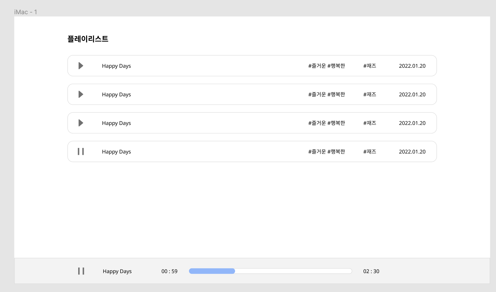

# 프론트엔드 엔지니어 기술 과제: 요구 사항

본 문서는 기술 과제에서 제출해야할 페이지 구성 등을 설명합니다. 아래의 요구 사항에 만족하는 플레이리스트 페이지 구현 및 음악재생 플레이어를 구현해주세요.

## 과제 진행 안내

### 제출

- 제한 시간: 48시간
- 과제는 모든 파일을 zip 파일로 압축한 뒤 메일로 제출해주세요.

### 프로젝트 구성 및 제한사항

- Typescript 기반으로 구성된 간단한 CRA 입니다.
- Typescript를 기반으로 코드를 작성해야 합니다.
- 필요한 라이브러리가 있는 경우 자유롭게 설치 가능합니다.
  - 단, **오디오 조작은 반드시 Web Audio API를 사용**해야 합니다.
  - react-audio-player등과 같은 라이브러리는 사용할 수 없습니다.
- redux와 같은 상태 library 혹은 react-query와 같은 library를 사용해야 합니다.
  - 상태라이브러리 혹은 fetching hooks library의 종류는 자유롭게 사용 가능합니다.
- api에서 리턴되는 오류에 대한 처리 또한 구성이 되어야합니다.
- api를 호출하는 중간의 로딩화면이 구성되어야합니다.
  - 로딩화면의 디자인은 자유롭게 구성가능합니다.
  - 하지만, 로딩되는 동안 다른 버튼을 클릭 할 수 없도록 디자인 혹은 기능이 구성되어야합니다.

<br/>

## 과제 개요

### API

- 현재 세팅되어있는 mock서버를 통해서 api를 호출합니다.
  - mock서버는 mirage를 사용하였으며, mock 서버와 관련된 폴더(mockServer, index.tsx의 createMockServer)의 수정 및 삭제에 유의해주세요.
  - mock 서버의 url은 http://localhost:8000으로 설정해주시면 됩니다.
- 음원 목록 조회
  - 엔드포인트 : **GET /musics**
  - Response
  ```jsx
  {
    total: number;
    items : {
  		id: string;
  		title: string;
  		moods: string[];
  		genre: string;
  		public_date: string;
  	}[]
  }
  ```
- 음원 url 조회
  - 엔드포인트 : **GET /musics/{musicId}**
  - mock서버에서 응답 받은 후, 2초 후에 결과가 리턴됩니다.
  - Response
  ```jsx
  {
    url: string;
  }
  ```

### 개요

음악을 들을 수 있는 플레이리스트 페이지를 구성해주세요. 플레이리스트 페이지는 음원 목록이 제공되며, 음원을 클릭하면 오디오플레이어로 음악이 재생되는 기능을 갖고 있는 페이지입니다.

`플레이리스트 페이지`

- 제공되는 api를 통해 음원 리스트를 호출하여 화면에 출력합니다.
- 제공되는 데이터를 발매일 순으로 최신 발매일이 상단에 가도록 정렬하여 출력되어야 합니다.
- 음원 리스트에서의 각 음원은 `음원 제목, 분위기, 장르, 발매일` 이 데이터로 출력되어야 합니다.
  - 발매일은 `yyyy.MM.dd`의 형태로 출력되어야합니다.
- 각 음원 앞에는 `재생버튼` 이 존재하며, 재생버튼을 클릭하면 오디오플레이어가 하단에 나타나며, 음악이 재생됩니다.
  - 음악에 대한 url은 제공되는 api를 통하여 값을 받아올 수 있습니다.

`오디오 플레이어`

- 초기 렌더링에서는 오디오 플레이어는 화면에 나타나지 않습니다.
- 음원에서 재생버튼을 클릭하면 오디오 플레이어가 화면에 나타납니다.
- 음원에서 재생버튼을 클릭했기 때문에 오디오 플레이어가 화면에 나타나고, 음원이 자동재생됩니다.
- 오디오 플레이어에는 현재 재생(또는 일시정지)하고 있는 음원의 `음원 제목, 현재 재생 시간, 재생바, 총 음원 재생시간` 이 데이터로 출력되어야합니다.
  - 현재 재생 시간 및 총 음원 재생 시간은 `00:00`의 형태로 분과 초로 나뉘어야합니다.
- 오디오 플레이어에는 재생버튼이 나타나며 재생 중일 때에는 일시정지 버튼, 일시정지일 때는 재생 버튼이 나타납니다.
  - 해당 음원의 재생버튼 상태가 음원 목록에서도 동일하게 적용되어야 합니다.
- 총 음원 길이는 api를 통해 받아온 음원에서 추출합니다.
- 재생바는 음원이 재생될때마다 색이 채워지며, 재생바 클릭시, 해당 위치 부터 음원이 재생됩니다. 또한, 현재 음원 재생 시간도 함께 업데이트가 되어야합니다.
- 음원 목록에서 다른 음원의 재생버튼을 클릭하면 해당 음원이 처음부터 재생이 됩니다.
- 일시정지 버튼을 클릭하면 음원 재생이 정지되며, 다른 음원을 클릭하지 않고 동일한 음원의 재생버튼을 클릭하면 현재 재생시간부터 이어서 음원이 재생됩니다.

`로딩화면`

- api를 받는 동안의 wait 상태에서는 로딩화면이 나타나야합니다.
  - 로딩화면 디자인은 자유롭게 구성 가능 하나, 다른 컴포넌트의 동작이 일어나지 않도록 방지 되어야합니다.

(예시 화면)



### 기타

- 필요한 라이브러리가 있는 경우 설치 가능합니다.
- 과제에 대한 해결전략이나 구성 등이 README.md에 명시되어야합니다.
  (특정 라이브러리를 사용했을 경우, 해당 라이브러리를 사용한 이유에 대해 명시 해주세요.)
- 디자인은 styled-component, sass, tailwind 등 모두 사용 가능 합니다.
  - 재생버튼 및 일시정지 아이콘은 `src/assets/images` 경로를 확인해주세요.
- 화면 및 컴포넌트의 디자인은 자유롭게 구성해주시면 됩니다.
  - 재생바 또한 자유롭게 구성해주세요. (파형으로 구성된 재생바도 가능합니다.)
- 가능하시다면 테스트 라이브러리를 사용하여 테스트 코드를 작성해주세요. (optional)

### 유의 사항

- 구현의 완성도도 중요하지만, 코드의 재사용성이나 최적화에 대한 고민이 많이 들어간 코드를 더 선호합니다.
- 제출 시, node_modules와 같이 설치 가능한 의존성 파일들은 제거 후에 제출해주세요.
- 빌드된 결과물이 아닌 작업 가능한 상태의 코드를 제출를 제출해주세요.
- mock 서버와 관련된 코드가 삭제되면 api 호출이 어려워 관련 폴더 및 파일(mockServer, index.tsx의 createMockServer)의 삭제에 유의해주세요.

## 저작권

해당 문제에 대한 저작권은 주식회사 포자랩스(이하 '회사')에게 있으며 수령자는 오로지 채용을 위한 목적으로만 해당 문제를 활용할 수 있습니다.
사유를 불문하고 해당 문제의 전부 또는 일부를 공개, 게재, 배포, 제3자에게 제공 하는 등의 일체의 누설 행위에 대해서는 저작권법에 의한 민.형사상의 책임을 질 수 있습니다.
아울러 이러한 누설 금지 행위에는 문제의 문구를 변형하여 그 취지를 알 수 있도록 하는 경우 포함됩니다.
